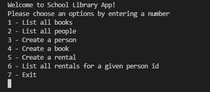

# OOP-school-library

> In this project, I have created  my school library app. 

## Built With

- Ruby

## Getting Started
### In order to setup this project locally you have to run following commands:
- Click on the `Code` button with background color green on the right end corner
- Click on the clipboard icon on the extreme right of the dropdown to copy the repository link
- In your local PC, open your terminal or command prompt in the folder you would like to clone this repository into
- Type git clone `(copied link)` on the currently opened terminal or command prompt
- Remember to change `(copied link)` to `git@github.com: Laylo309/00P-school-library.git` which is the name of the repository

### This repository includes files with Ruby that can be used to is getting information from the library about the University:

- Please run the program in a IRB enviorement
- From your terminal you have to run the following command: `ruby main.rb`
- After running this command you will get following kind of information:

- To run test use following command: `rspec`
- After running this command you will get following kind of information:

  ## Author
👤 **Laylo Khodjaeva**

- GitHub: [@Laylo309](https://github.com/Laylo309)
- Twitter: [@Laylo](https://twitter.com/home?lang=en)
- LinkedIn: [LayloKhodjaeva](https://www.linkedin.com/in/laylo-khodjaeva-05a972207/)

👤 **Nelsino**

- GitHub: [@nelsinofrancisco](https://github.com/nelsinofrancisco)
- Twitter: [@nelsino_s](https://twitter.com/nelsino_s)
- LinkedIn: [LinkedIn](https://www.linkedin.com/in/nelsinofrancisco/)
## 🤝 Contributing

Contributions, issues, and feature requests are welcome!

Feel free to check the [issues page](../../issues/).

## Show your support

Give a ⭐️ if you like this project!

## Acknowledgments

- Inspiration
- Microverse

## 📝 License

This project is [MIT](./MIT.md) licensed.
